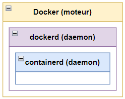
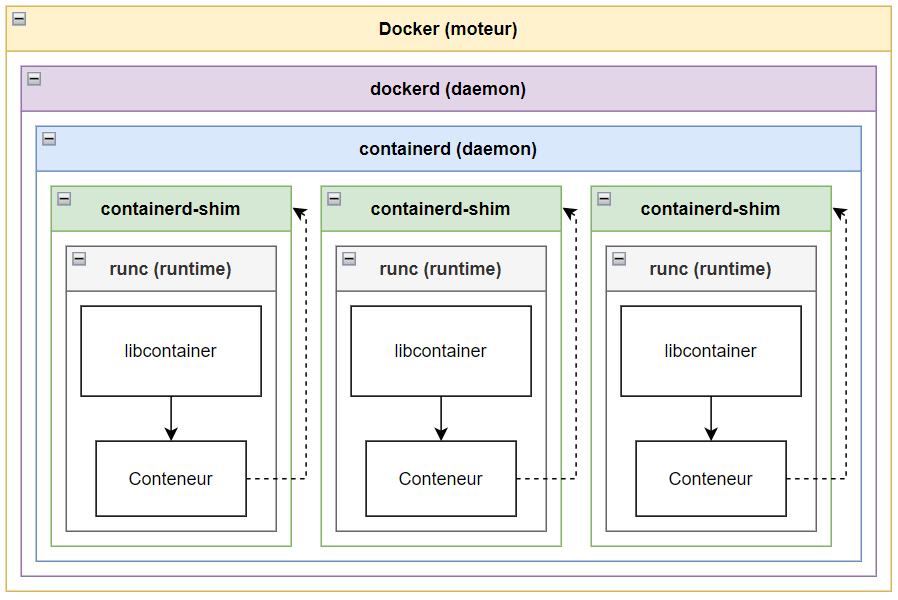

## Présentation de Docker, Inc.

dotCoud, Inc. est une société américaine fondée en 2008 par Kamel Founadi, Solomon Hykes et Sebastien Pahl. A l'origine, il s'agissait d'une PaaS (Platform as a Service) qui permettait aux développeurs de compiler et exécuter du code sur leur plateforme.

En 2013, la société se renomme Docker, Inc et lance un produit homonyme qui révolutionne l’utilisation des conteneurs. Au fil du temps, Docker développe plusieurs produits qui sont considérés aujourd’hui comme des standards de l’industrie des conteneurs :

- Leur produit phare homonyme est un moteur de conteneur qui occupe aujourd’hui la moitié du marché mondial. 
- DockerHub est une solution de stockage et de distribution de conteneurs, comme un GitHub spécialisé pour les conteneurs. Il est utilisé par des organisations mondialement connues. 
- containerd est le runtime[^1] de conteneur (l’équivalent d’un hyperviseur pour une machine virtuelle) de Docker. containerd à été donné par Docker à la Linux Foundation et est aujourd’hui le runtime standard de la CNCF (Cloud Native Computing Foundation)
- Le projet Moby est composé de librairies pour la gestion de conteneurs, un cadre de test et de déploiement de conteneurs. Il sert à la construction de systèmes plus complexes basés sur Docker et containerd. 
- Docker Scout est un analyseur de conteneurs qui aide les développeurs à corriger les vulnérabilités connues. 

Docker est l’entreprise la plus connue sur le marché des conteneurs et de leur gestion et possède aujourd’hui la plus grande part du marché, mais elle subit une concurrence de plus en plus rude de la part de AWS et Azure. 

## Fonctionnement de Docker

Nous allons à présent nous concentrer sur le produit Docker, et plus particulièrement le fonctionnement de sa gestion de conteneurs sous Linux. 

Docker est un moteur de conteneurisation, c'est-à-dire un outil qui permet de les construire, les exécuter et les gérer. 

La conteneurisation est une forme de virtualisation alternative qui n’émule pas de système d’exploitation complet. Chaque conteneur fonctionne dans un environnement qui contient les éléments strictement nécessaires à sa fonction.  
Grâce à ceci, nous pouvons éclater les serveurs en plusieurs conteneurs responsables chacun d’un service. Ceci permet d’avoir un contrôle plus fin des ressources allouées et facilite la continuité de production pendant les mises à jour. En effet, il est plus facile de prédire les besoins d’un programme unique comme Apache qu’un système entier. Ainsi, les conteneurs sont moins gourmands en ressources que les machines virtuelles standard. De plus, la possibilité de gérer les conteneurs individuellement permet de cibler les arrêts programmés sans aucune répercussion sur les autres services en cours. 

<figure markdown>
  { loading=lazy }
  <figcaption>Comparaison d’ensemble entre les conteneurs et les machines virtuelles</figcaption>
</figure>  

Les conteneurs présentent aussi un gros avantage pour le développement d’applications car ils permettent de s’affranchir des contraintes de l’environnement : une fois exportée avec ses dépendances, une image[^2] de conteneur est autosuffisante et peut être exécutée sur n’importe quelle machine qui prend en charge Docker, indépendamment du système d’exploitation ou de caractéristiques matérielles. 

Docker est un outil extrêmement puissant qui permet de développer des conteneurs, créer des images, les exporter, les lancer et les gérer. 

### Fonctionnement de haut niveau

Derrière son faible coût opérationnel et son interface intuitive se cache un outil complexe, dont nous étudierons les principes de base de fonctionnement ci-dessous. 

- Quand on utilise l’interface de Docker (quand on clique sur le bouton “arrêter le conteneur” par exemple), nos actions sont interprétées par un daemon, dockerd. Celui-ci est responsable des tâches de haut niveau comme le build ou l’authentification. 
- containerd est un autre daemon responsable du cycle de vie des conteneurs (démarrage, gestion, arrêt), de la gestion de leur images ainsi que d’autres opérations comme la gestion des ressources de stockage et du réseau virtuel. Il est couramment surnommé “runtime de haut niveau”. 

Ces deux daemons communiquent par gRCP (envoi de commandes via des ports réseau). 

<figure markdown>
  { loading=lazy }
  <figcaption>Diagramme des paquetages de haut niveau</figcaption>
</figure>

Celà-dit, containerd ne crée pas les conteneurs lui-même et doit faire appel à des programmes sous-jacents prévus à cet effet. 

### Fonctionnement de bas niveau

Dans son état initial, un conteneur est une archive contenant une image et un fichier de configuration JSON.

L’image de conteneur à la même fonction qu’une image de machine virtuelle, elle contient les binaires à exécuter.  
Le fichier JSON sert à transmettre les directives relatives aux binaires à exécuter, à l’allocation des ressources et à l’emplacement du rootfs[^3].

Chez Docker, le conteneur est extrait, exécuté puis géré par libcontainer. C’est ce programme qui exécute les actions de bas niveau, notamment la communication avec le système (namespaces[^4], cgroups etc). C’est le véritable runtime de Docker. 

libcontainer possède une API[^6] : runc. Cette dernière permet d'interagir avec libcontainer par ligne de commande. C’est l’API runtime officielle de la Open Container Initiative depuis que Docker leur à fait don de libcontainer. 

<figure markdown>
  { loading=lazy }
  <figcaption>Diagramme des paquetages de bas niveau</figcaption>
</figure>

### Lien entre les deux niveaux

containerd n’appelle pas directement runc pour créer un conteneur. Une shim[^5] est utilisée pour rendre les conteneurs indépendants de Docker.  
Ceci à plusieurs avantages :

- Une fois le conteneur démarré, runc peut s’arrêter. Ceci limite la quantité de processus qui fonctionnent de façon perpétuelle. 
- La shin intercepte les entrées / sorties et les descripteurs de fichiers du conteneur :
    - Le conteneur peut ainsi survivre au redémarrage de Docker
    - La shin peut loguer et transmettre les informations d’état du conteneur sans que Docker ait besoin d’attendre le changement d’état avec un appel système.

Ainsi, la shim démarre runc puis récupère le lien de parenté du conteneur au moment où runc s’arrête. 

On obtient donc le diagramme de paquetages complet suivant :

<figure markdown>
  { loading=lazy }
  <figcaption>Diagramme de paquetages complet</figcaption>
</figure>

## Sécurité

### Sécurité conceptuelle

Les conteneurs sont naturellement moins sujets au risque grâce à leur isolement. Par défaut, leur capacité à interagir avec le système ou les autres conteneurs est très limitée. Il en découle que les risques qu’ils soient contaminés par un code malicieux ou qu’ils infectent le système ou un autre conteneur sont plus faibles. 

De plus, ils sont faciles à mettre à jour ou à arrêter en cas de besoin, prenant moins de temps et ayant moins d’incidence sur la production que les machines virtuelles normales. 

Les conteneurs ont une durée de vie assez faible, ce qui limite la fenêtre d’action d’un attaquant éventuel et réduit sa probabilité de succès. 

### Sécurité Linux

N’utilisant pas de superviseur, les conteneurs sont gérables avec les outils de sécurité Linux. 

Nous verrons ici quelques outils couramment utilisés pour sécuriser les conteneurs sur Linux. 

Docker peut être sécurisé grâce à Linux Security Module,une infrastructure Linux qui permet d’ajouter certaines extensions au noyau, notamment capabilities, SELinux et AppArmor. 

#### capabilities

capabilities est un module de gestion de droits. Les appels système et les exécutables sont associés à des groupes et ne peuvent être exécutés que par un processus appartenant au même groupe. Ceci permet d’avoir un contrôle beaucoup plus fin sur les droits des processus et permet d’implémenter une politique de moindre privilège, renforçant ainsi la sécurité. 

#### SELinux

Security-Enhanced Linux est un autre module de sécurité permettant de mettre en place des contrôles d’accès obligatoires (MAC). Son fonctionnement est semblable à celui de capabilities : chaque entité se voit attribuer des tags, qui correspondent à des autorisations. Si l'action demandée par un processus ne fait pas partie des autorisations dont elle dispose, elle n’est pas exécutée. Une utilisation très granuleuse de ce système entraîne une grande complexité d’administration.  
Par ailleurs, même les processus ayant le PID 0 sont soumis aux politiques. 

#### AppArmor

AppArmor est né du besoin d’avoir un outil plus facilement administrable que SELinux. 
Il se distingue de ce dernier par sa capacité à étudier les processus et proposer des profils personnalisés automatiquement. En effet, un de ses modes de fonctionnement permet de loguer les infractions au profil par défaut plutôt que de les bloquer. AppArmor propose ensuite un profil de droits en fonction des appels recensés. 
Contrairement à SELinux, AppArmor fonctionne avec des liens plutôt qu’avec des tags, et est donc compatible avec tous les systèmes de fichiers. 

#### seccomp

secure computing mode permet d’isoler un processus en interdisant tout appel système à l’exception de exit(), sigreturn(), read() et write()sur les descripteurs de fichier déjà ouverts. Si le processus fait un autre appel système, il est tué.  

Cette fonctionnalité peut être utilisée pour isoler efficacement les conteneurs du système. Il est à noter que l'extension seccomp-bpf permet de personnaliser les appels système filtrés pour donner plus de flexibilité aux conteneurs. 

### Points faibles

#### Partage de la mémoire

Les conteneurs sont souvent construits à partir d’autres conteneurs déjà existants, et dépendent souvent des mêmes librairies. 

Si deux conteneurs utilisent la même librairie, elle n'est chargée qu’une seule fois en mémoire et les deux conteneurs y accèdent en concurrence. 

Bien que ceci soit sans danger pour une librairie comme stdlib, des librairies plus complexes pourraient être exploitées pour transmettre des données entre deux conteneurs et offrir ainsi une faille de sécurité potentielle. 

Aujourd’hui, la plupart des conteneurs sont compilés avec toutes leur dépendances de sorte à ne pas avoir à s'appuyer sur des librairies partagées. 

#### Failles découvertes

Depuis la création de Docker, plusieurs failles ont été découvertes. La plus impressionnante donnait la possibilité aux conteneurs d’écraser l’exécutable runc avec leur propre code. Ainsi, containerd, mais Docker et Kubernetes étaient vulnérables à une attaque par conteneur et mettaient en danger le système et les données qui s’y trouvent. 

D’autres failles majeurs ont été découvertes:

Dans certains cas, un conteneur fraîchement démarré pouvait écrire dans des fichiers dont il ne disposait que le droit de lecture. Ceci pouvait lui permettre de faire une escalade de privilèges.
Une autre vulnérabilité permettait d’injecter du code dans le conteneur lors d’un chargement dynamique de librairie. 
Une version de Docker crashait lorsque le logiciel lisait un fichier JSON erroné au moment de démarrer le conteneur.

## Conclusion

Docker est un outil puissant qui à démocratisé l’utilisation des conteneurs pour le développement d’applications et les services cloud.

Docker permet de faciliter la création et le déploiement d’applications, tout en diminuant leur coût de fonctionnement. Étant autonomes et s’intégrant avec les services de sécurité de Linux, les conteneurs sont aussi un bon vecteur de sécurisation des services d’une organisation. 

Cela-dit, il est possible d’augmenter encore la fiabilité et le rendement des conteneurs en utilisant des systèmes d’automatisation comme Kubernetes, qui sera abordé dans la prochaine partie. 

## Sources

!!! question "Lier les sources directement depuis le texte?"

- [Docker](https ://www.docker.com/)
- [Wikipedia - Docker](https ://en.wikipedia.org/wiki/Docker_(software))
- [Wikipedia - OS virtualization](https ://en.wikipedia.org/wiki/OS-level_virtualization)
- [Palark - Statistiques de marché ](https ://blog.palark.com/kubernetes-and-containers-market-trends-2021/)
- [containerd](https ://containerd.io/)
- [CNCF](https ://www.cncf.io/announcements/2019/02/28/cncf-announces-containerd-graduation/)
- [Moby](https ://mobyproject.org/)
- [Documentation de Docker Scout](https ://docs.docker.com/scout/)
- [stack overflow - containerized vs libcontainer](https ://stackoverflow.com/questions/62024186/where-does-libcontainer-stand-in-docker-stack)
- [opensource.com - runtimes](https ://opensource.com/article/18/1/history-low-level-container-runtimes)
- [Wikipedia - Namespaces](https ://en.wikipedia.org/wiki/Namespace)
- [Wikipedia - SELinux](https ://en.wikipedia.org/wiki/Security-Enhanced_Linux)
- [Documentation de Docker dockerd](https ://docs.docker.com/engine/reference/commandline/dockerd/)
- [PDF de Dockercon16](https ://github.com/crosbymichael/dockercon-2016/blob/master/Creating%20Containerd.pdf)
- [SELinux](https ://selinuxproject.org/page/Main_Page)
- [Wikipedia - seccomp](https ://en.wikipedia.org/wiki/Seccomp)
- [Google - seccomp](https ://code.google.com/archive/p/seccompsandbox/wikis/overview.wiki)
- [Editions Diamond - Capabilities](https ://connect.ed-diamond.com/GNU-Linux-Magazine/glmf-164/les-capabilities-sous-linux)
- [man7 - Capabilities](https ://man7.org/linux/man-pages/man7/capabilities.7.html)
- [Wikipedia - runtime](https ://fr.wikipedia.org/wiki/Environnement_d%27ex%C3%A9cution)
- [Wikipedia - Shim](https ://en.wikipedia.org/wiki/Shim_(computing))
- [Demystifying container runtimes](https ://lwn.net/Articles/741897/)
- [Faille runC](https ://www.lemondeinformatique.fr/actualites/lire-snyk-aide-les-devsecops-a-gerer-les-risques-des-applications-cloud-92456.html)
- [Quarkslab - Digging into runtimes](https ://blog.quarkslab.com/digging-into-runtimes-runc.html)
- [Wikipedia - Diagramme des paquetages](https ://fr.wikipedia.org/wiki/Diagramme_des_paquetages)

[^1]: Runtime : environnement d’exécution d’un programme qui est responsable de la communication entre le programme et le matériel et le système d’exploitation. 

[^2]: Image : c’est en tant qu’image qu’un conteneur inactif persiste dans le temps, semblable à une image de machine virtuelle. 

[^3]: rootfs : Root File System, l’emplacement du dossier racine du système de fichiers du système. 

[^4]: namespaces : dans un système d’exploitation, tous les noms doivent être uniques (on ne peut pas avoir deux fichiers ou processus ayant le même nom). Ceci est très limitant, notamment pour faire tourner plusieurs conteneurs en parallèle. namespaces permet de définir la portée des noms et donc de les réutiliser sans créer de conflits. 

[^5]: shim : une shim est un interface qui intercepte les appels système et API d’un programme pour les traiter soi-même. Elles sont souvent utilisées pour pallier des problèmes de compatibilité entre programmes vieillissants. 

[^6]: API : Application Programming Interface désigne une interface qui permet à un programme de communiquer avec d’autres en se basant sur un protocole de communication commun.
