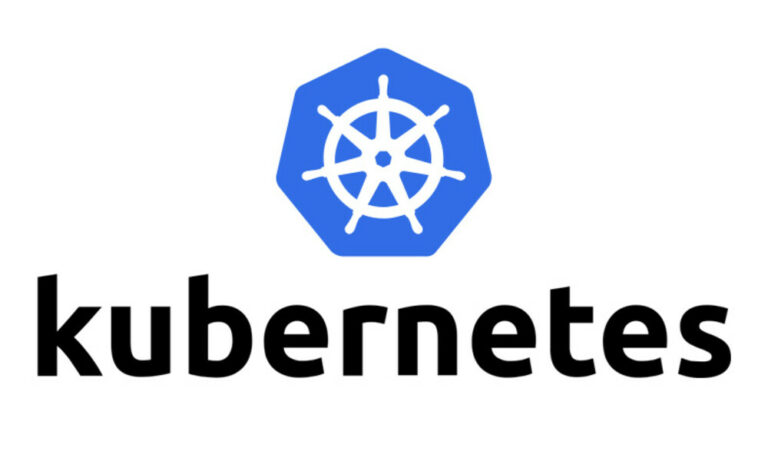
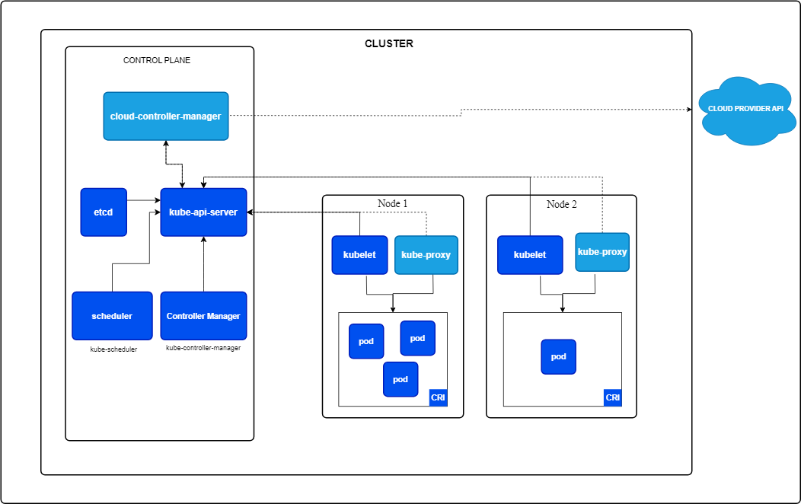
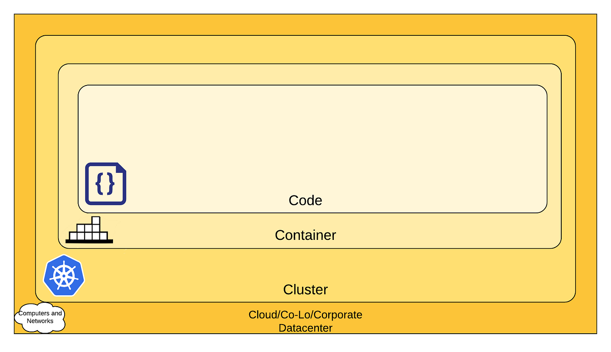

## 2.1 - Présentation de Kubernetes

Kubernetes est une plateforme permettant d'automatiser le déploiement, la montée en charge et la mise en œuvre de conteneurs d'application sur des groupes de serveurs. Kubernetes est aussi une plateforme de microservices. Aujourd’hui, toutes les applications sont composées de microservices, des de services monotâches. Kubernetes permet de mettre en relation tous les microservices dispersés à travers plusieurs conteneurs afin d’exécuter une application.

Kubernetes favorise à la fois l'écriture de configuration et l'automatisation de création de conteneur. Les services, le support et les outils Kubernetes sont facilement intégrables à un cluster. 
Kubernetes est un système open source. Il est développé par Google et la Cloud Native Computing Foundation. La première annonce de Kubernetes a été faite en 2014 et sa  première version est sortie en 2015.

Il permet le stockage des informations sensibles comme des mots de passe, des jetons d’authentification ou des clés.  
Il ne faut pas confondre l’utilisation de kubernetes avec :

- un service mesh : un service d’application préconfiguré qui permet aux différents services de communiquer entre eux, de partager des données et d’assurer une cohérence tout au long du cycle de vie d’une application. Par exemple, le service mesh Istio est un outil pour Kubernetes.
- Platform as a Service system tel que Docker.

Il existe plusieurs distributions telles que minikube pour la gestion d’un cluster local ou Amazon Elastic Kubernetes Service (Amazon EKS).

Kubernetes est basé sur le langage de programmation Go. Il possède une communauté active sur la détection et le patch de failles.

## 2.2 - Fonctionnement de Kubernetes

### 2.2.1 - Architecture

Les pods sont les plus petites unités informatiques déployables qui peuvent être créées et gérées dans Kubernetes. Un pod est un groupement d’un ou plusieurs conteneurs qui partagent les mêmes ressources et stockage. Le conteneur d’un pod peut être exécuté en mode privilégié.

Une node est une machine physique ou virtuelle (en fonction du cluster). Tous les clusters possèdent au moins une node. Chaque node est dirigée par le panneau de contrôle et contient les services nécessaires pour exécuter chaque pod.

Les composants d’une node incluent :

- kubelet, un agent qui permet d'exécuter chaque node et permet de vérifier que chaque conteneur est dans un pod.
- Container Runtimes,un logiciel qui permet de faire tourner les pods, il est responsable pour les conteneurs en cours d'exécution.
- Le Container Runtime Interface (CRI) permet à kubelet d’utiliser les conteneurs sans avoir besoin de recompiler tous les composants d’un cluster.

Kubernetes possède un ordonnanceur[^1] pour s’assurer du bon fonctionnement des pods avec les nodes. Ce fonctionnement dépend de contraintes comme les ressources ou les politiques.

Le Cloud Controller Manager permet à Kubernetes de contrôler les ressources. Il possède de nombreux outils comme le node controller qui est responsable de la mise à jour des nodes afin qu’elles correspondent aux normes du serveur. Il permet également de configurer des routes dans le cloud ainsi que du filtrage de paquets, de l’adresse IP et du load balancing.

Les applications peuvent accéder aux ressources d’un hôte sans avoir nécessairement besoin des informations contenues dans celui-ci. 

L’utilisation de baux permet d’avoir un mécanisme qui bloque les ressources partagées et coordonne les activités entre les différents membres d’un même ensemble.

Kubernetes a un daemon (kube-controller-manager) qui est composé de plusieurs contrôleurs :
Node Controller qui permet de détecter et d’apporter une réponse si un nœud tombe en panne.
Endpoint Controller permet de joindre les services et les pods. 
Service Account and Token Controllers gère les comptes et les jetons pour l’accès à l’API.

Il existe une communication entre les nodes et le panneau de contrôle à travers un appel gRPC.

Kubernetes possède un serveur API qui permet aux utilisateurs de contrôler les clusters. 

Kubernetes permet de gérer la durée de vie d’un pod et son arrêt. Un utilisateur peut également administrer chaque pod pour changer les informations. Cependant, certaines informations d’un pod sont immuables telles que son nom ou sa date de création.

De plus, Kubernetes possède une “garbage collection” qui regroupe divers mécanismes pour garder un environnement propre. Par exemple, il est utilisé lorsque les pods se terminent ou pour supprimer les objets sans référence à un propriétaire.

### 2.2.2 - Services

Kubernetes définit un service comme une méthode permettant d'exposer une application réseau qui s'exécute sous une ou plusieurs pods dans un cluster comme kube-proxy.

kube-proxy est exécuté sur chaque node. Il permet de prendre en compte les services définis dans l’API Kubernetes de chaque nœud.

L’utilisation de mixed version proxy permet aux administrations d’un cluster de haute disponibilité de configurer ce cluster et de le mettre à jour de façon plus sûre en demandant les ressources vers le bon serveur API.

### 2.2.3 - Stockage des données

Toutes les informations du cluster sont stockées dans etcd, une base de données pour des paires clé-valeur. Les informations stockées peuvent être l’état actuel d’un cluster, les différentes configurations pour les ressources ou les données d’exécution. L’utilisation d’etcd permet d’avoir une consistance et une haute disponibilité des valeurs clés stockées pour toutes les données du cluster.

## 2.3 - Sécurité

### 2.3.1 - Concept de base

La sécurité de Kubernetes est basée sur le Cloud Native Security. Cette sécurité se base sur la notion des 4 C, chaque couche du modèle s’appuyant sur la sécurité de sa couche externe.

La sécurité de Kubernetes se fait sur deux axes : 

- la sécurité des composants qui sont configurables dans un cluster.
- la sécurité des applications qui sont exécutés dans un cluster.

Kubernetes gère la sécurité des composants d’un cluster et non les applications qui sont exécutées ou les conteneurs.

### 2.3.2 - Authentification et autorisation

Kubernetes définit deux catégories d’utilisateurs, les comptes de services gérés par Kubernetes et les utilisateurs normaux.

Les utilisateurs normaux sont :

- un administrateur distribuant les clés privées
- un user store, un dépôt de comptes utilisateurs et de credentials 
- un fichier avec une liste d’utilisateurs et de mots de passe

Les utilisateurs normaux ne peuvent pas être ajoutés à un cluster à travers les appels API. Un utilisateur qui présente un certificat signé par la CA (certificate authority) du cluster est considéré comme authentifié. Chaque utilisateur appartient à un groupe, ce qui lui donne certains droits.

Kubernetes utilise les certificats pour les connexions clients avec des jetons ou une authentification proxy pour authentifier des requêtes d’API. Pour éviter une attaque par usurpation d’identité, l’utilisation d’un proxy d’authentification est nécessaire dans le but de vérifier la validité du certificat présenté par le client.

Les static token sont un type d’authentification pour l’accès au serveur API. L’administrateur définit un ensemble de jetons d’accès, ces jetons sont liés à des métadonnées qui permettent de lier des utilisateurs à des groupes durant le processus d’autorisation.

Le service account tokens authentifie les jetons d’une requête faite à l’API serveur.

### 2.3.3 - Accès réseau

Tous les accès de Kubernetes ne sont pas publiquement alloués. Chaque accès passe par une  liste d’adresses IP. 
Par exemple, Les nodes sont configurées pour n’accepter que les connexions qui viennent de cette liste.

Lorsque l’accès est nécessaire, Kubernetes utilise OpenID Connect Tokens, un OAuth2[^2] afin qu’une application puisse utiliser des ressources extérieures au nom d’un utilisateur.

### 2.3.4 - Stockage sécurisé

Kubernetes définit une notion “Secrets” pour garder une information sensible comme les mots de passe ou les clés d’authentification. Il enregistre cette information dans un pod spécifique ou une image d’un conteneur. Les secrets et les crédentials ont une durée de vie courte. Kubernetes conseille d’encrypter les sauvegardes de la base de données etcd. 

Pour supprimer les jetons qui ne sont plus utilisés, Kubernetes appelle le daemon “kube-controller-manager” et en particulier la partie Service Account and Token Controllers.

Kubernet offre la possibilité de chiffrer les données qui ne sont pas utilisées. 
Ces solutions permettent de réduire les risques d’attaques.

## 2.4 - Limites de Kubernetes

### 2.4.1 - Limites matérielles

Kubernetes possède une limitation par la taille maximale des différentes composantes d’un cluster. Par exemple, il ne peut y avoir plus de 110 pods dans une node .

De plus, kubele et les conteneurs en exécution ont besoin de cgroup dans le but de répartir les différentes ressources.

### 2.4.2 - Failles

Une faille critique a été découverte en 2018. Un utilisateur pouvait se connecter au serveur API et envoyer des requêtes directement aux serveurs backend sans avoir de vérification par le serveur API.
Les récentes failles trouvées sur Kubernetes touchent les Windows nodes. Ces failles permettaient à un utilisateur d’escalader en mode privilège sur des nodes ou des pods qu’il  créait.

## 3 - Conclusion

Les conteneurs sont une technologie émergente qui permet d’exporter et d’exécuter une application en s’abstrayant de son environnement. Ceci présente deux avantages majeurs : 

- Le développement et le test des applications sont grandement simplifiés
- Les exécutables ainsi créés sont autosuffisants, limitant leur dépendances aux ressources externes et donc leur vulnérabilité.  

La conteneurisation se distingue des autres formes de virtualisation par sa légèreté d’exécution et ses possibilités de gestion groupée. Ainsi, Kubernetes propose des outils efficaces de création, maintien en opération et autres formes de gestion des conteneurs visant à minimiser le temps d’arrêt de production et maximiser la sécurité des applications. 

En s'appuyant sur ces deux solutions, Docker et Kubernetes, il est possible de tirer le meilleur de la conteneurisation et gagner en efficacité matérielle, temporelle et économique. 

Kubernetes permet d’augmenter la sécurité de cette mise en relation de dockers à travers l’authentification et la gestion des ressources d’un cluster. Il ajoute également un niveau de sécurité à travers son stockage des données sensibles et sa limitation d’accès à des réseaux extérieurs d’un cluster.

Il faut cependant relever certains dysfonctionnements en matière de sécurité qui impactent principalement les architectures utilisant Windows. 

Toutes les PaaS majeures comme Microsoft, Amazon ou Google basent leurs services sur cette technologie et contribuent à son évolution permanente. La conteneurisation fait également son entrée dans les terminaux utilisateurs sous Windows 11.

[^1]: **Ordonnanceur** : l'ordonnance est le composant du noyau du système d'exploitation choisissant l'ordre d'exécution des processus sur les processeurs d'un ordinateur.

[^2]: **OAuth2** : Open Authorization est une norme conçue pour permettre à un site Web ou une application d'accéder aux ressources hébergées  par d’autres applications Web au nom d’un utilisateur.
